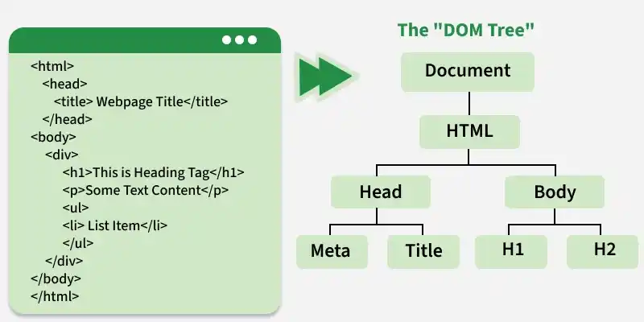

DOM (Document Object Model) is a W3C‑standard programming interface that represents an HTML or XML document as a structured tree of nodes, allowing scripts like JavaScript to access, modify, and update a page’s content, structure, and styles.
DOM:
A tree‑structured representation of a document where each element, attribute, and piece of text is a node. 
A platform‑ and language‑independent API standardized by W3C and WHATWG. 
Used by browsers to expose web pages to programming languages like JavaScript

Working of DOM
The DOM connects your webpage to JavaScript, allowing you to:

Access elements (like finding an <h1> tag).
Modify content (like changing the text of a 
 tag).
React to events (like a button click).
Create or remove elements dynamically.
Types of DOM
The DOM is seperated into 3 parts:

Core DOM: It is standard model for all document types(All DOM implementations must support the interfaces listed as "fundamental" in the code specifications).
XML DOM: It is standard model for XML Documents( as the name suggests, all XML elements can be accessed through the XML DOM .)
HTML DOM: It is standard model for HTML documents (The HTML DOM is a standard for how to get, change, add, or delete HTML elements.)

